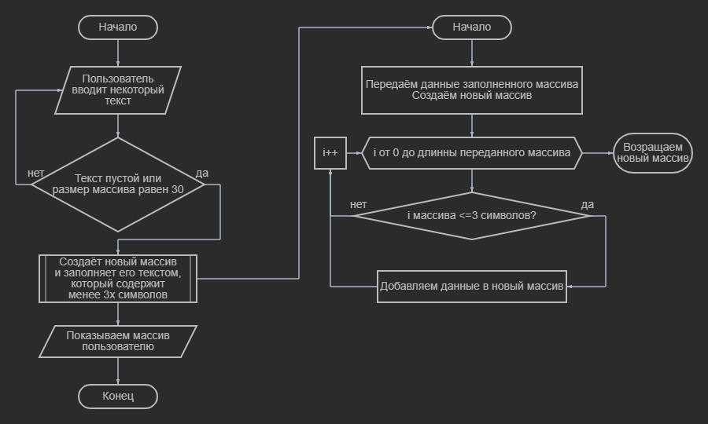

# Решение задачи

## Блок-Схема программы

### Задача:
Создать программу, которая из имеющегося массива формирует массив из строк, длинна которых меньше или равна 3 символам

### Решение задачи:
1. Создаём массив данных размером в 10 ячеек.
2. Просим пользователя ввести с клавиатуры некоторый текст.
3. Проверяем, не отправил ли пользователь **пустую строку** и не заполнены ли все 10 ячеек массива данными.
4. Создаём метод проверки массива, где условием будет: *символов в ячейке массива <= 3*.
5. Записываем в новую переменную данные, которые проходят по условию из 4 пункта.
6. Выводим пользователю новый массив на экран.

### Пример:
**Вводим:** [ 1, 22, 333, 4444, 5555 ]
**Вывод** [ 1, 22, 333 ]

**Вводим:** [ Привет, я, бот, Max, который, выполняет, поставленную, задачу ]
**Вывод** [ я, бот, Max ]